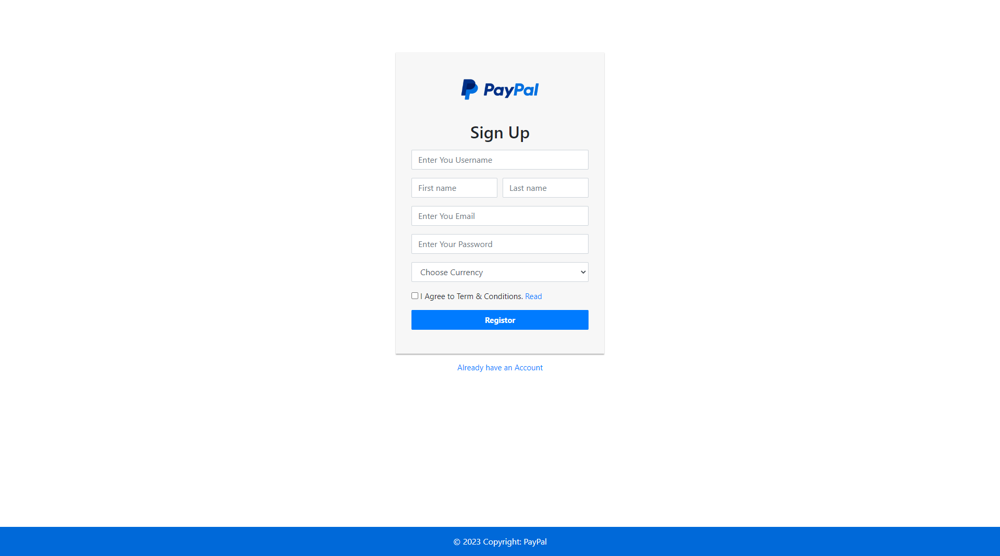
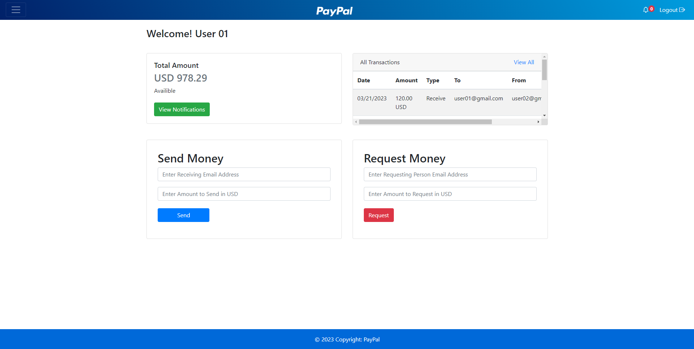
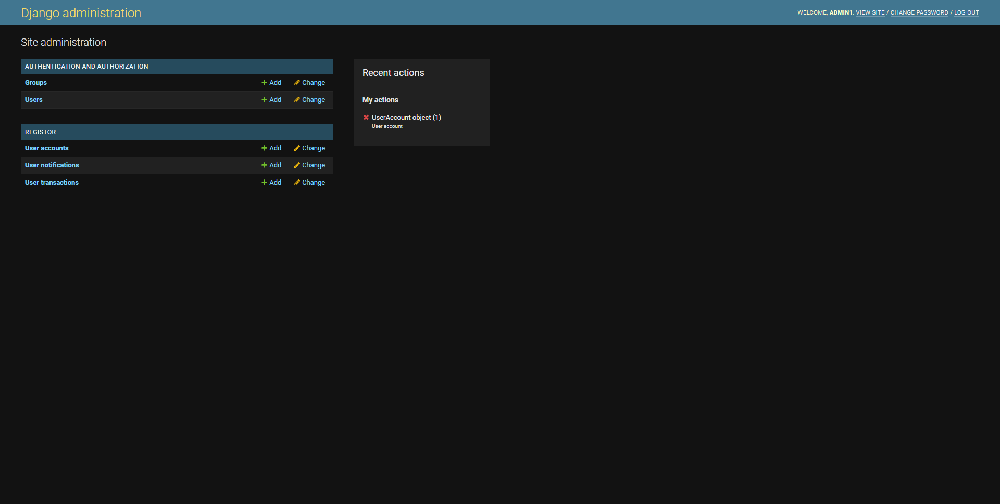

# PayPal-Django
This is a clone of PayPal application which is make in Django in which users create accounts and send money to other persons. Each person can select his currency and also gets demo dummy money to use for testing.

Person can send money to others and can also request money from other person using their email address. Each person gets a notification when someone send or request money.

There is also can API in the application that can convert the currency to other depending upon the exchange rate set in the application. Receiving person get the exchanged currency depending upon their selected currency.

To run the code we need Django and Python installed on the system:
``` 
python3 manage runserver
```

**Requirements**:

* Python
* Django ( `pip install django`)


## Screen Shots

#### Sign Up


#### Home Page


### Admin Page

